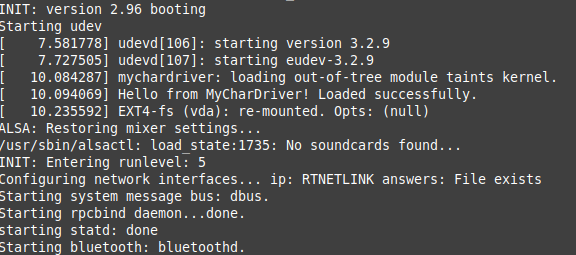
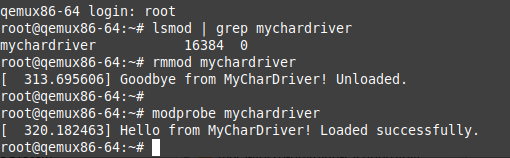

# meta-mychardriver – Yocto Layer for a Simple Character Driver

This repository contains a standalone Yocto layer that provides a tiny Linux character driver (`mychardriver`).  
The driver prints a static message to the kernel log and loads automatically during boot.


# Prepare YOCTO directory

```bash
mkdir ~/YOCTO
cd ~/YOCTO
```

```bash
#Own custom layer
git clone https://github.com/mnokka/meta-own-char-driver.git

#Core Yocto layers (dunfell branch) 
git clone -b dunfell https://git.yoctoproject.org/poky.git
git clone git://git.openembedded.org/meta-openembedded -b dunfell
```


# 1. Repository Structure

# Repository Structure

```text
meta-mychardriver/
├── conf/
│   └── layer.conf
└── recipes-kernel/
    └── mychardriver/
        ├── mychardriver.c
        ├── Makefile
        └── mychardriver_1.0.bb
```


# 2. 🛠️ Preparing a Yocto Build Environment

Initialize the build directory:

```bash
source poky/oe-init-build-env BUILD-MYCHARDRIVER
bitbake-layers add-layer ../meta-mychardriver
```

## 3. Local Yocto Configuration

Activate to local file YOCTO/BUILD-MYCHARDRIVE/conf

```bash
MACHINE = "qemux86-64"
```

## 4. Building and executing

Build the image

```bash
bitbake core-image-minimal
```

```bash
runqemu qemux86-64 nographic
```


Once the system has booted:

Check if the driver loaded automatically:


```bash
dmesg | grep mychardriver
```

Expected output:
Hello from MyCharDriver! Loaded successfully.

Check module list:


```bash
lsmod | grep mychardriver
```

Unload + reload manually:


```bash
rmmod mychardriver
modprobe mychardriver
```

## 5. File Installed by the Yocto Recipe

The driver installs to:
/lib/modules/<kernel-version>/extra/mychardriver.ko


Automatic loading config:
/etc/modules-load.d/mychardriver.conf

## 6. Boot time and un/load pics





